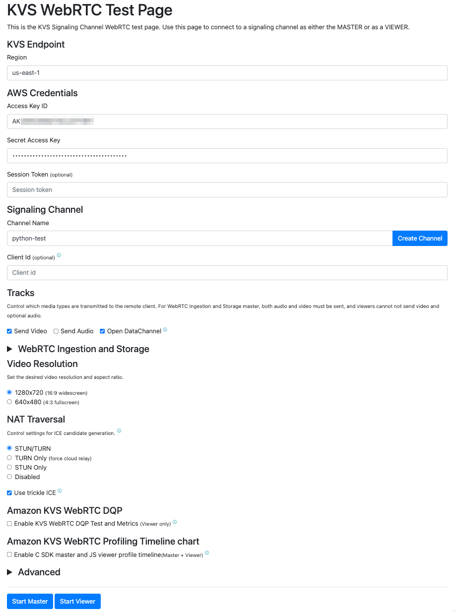
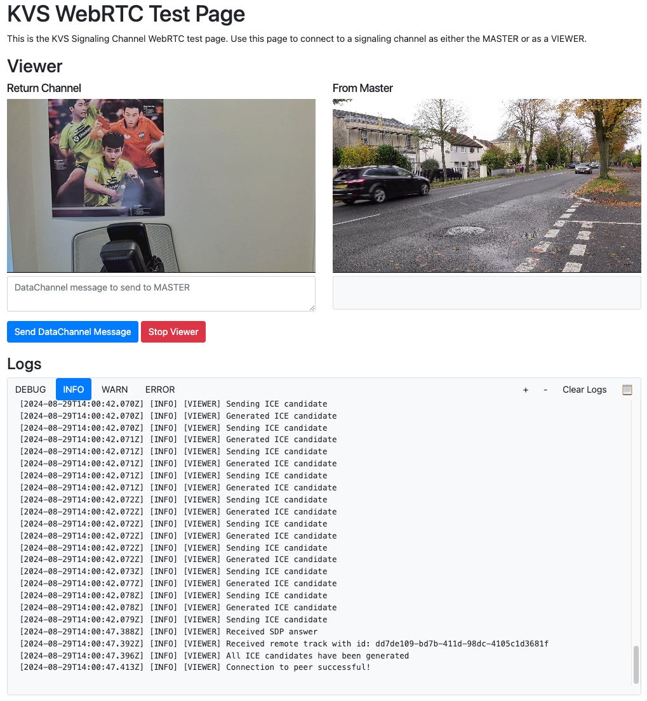
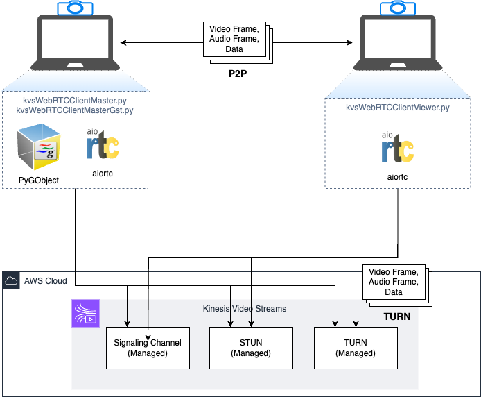
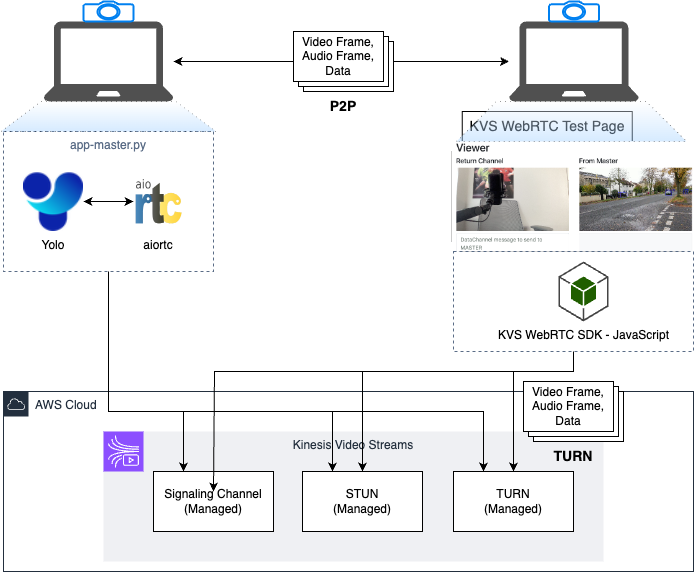

# python-samples-for-amazon-kinesis-video-streams-with-webrtc

The python-samples-for-amazon-kinesis-video-streams-with-webrtc repository provides a Python-based solution for transmitting media using Amazon Kinesis Video Streams (KVS) with WebRTC. It addresses the challenge of the lack of a dedicated Python library for KVS WebRTC by utilizing the WebRTC standard. This implementation demonstrates how to leverage WebRTC for real-time communication, enabling secure, low-latency media streaming and two-way interaction between IoT devices and WebRTC-compliant web or mobile applications.

## Table of Contents

- [Getting started](#getting-started)
  - [Clone the repo and install python dependencies](#clone-the-repo-and-install-python-dependencies)
  - [Install GStreamer and Dependencies (optional)](#install-gstreamer-and-dependencies-optional)
    - [Ubuntu](#ubuntu)
    - [macOS](#macos)
- [Set credentials](#set-credentials)
  - [Option 1: Temporary credentials using AWS CLI](#option-1-temporary-credentials-using-aws-cli)
  - [Option 2: Temporary credentials using CloudShell](#option-2-temporary-credentials-using-cloudshell)
  - [Option 3: IoT Device Certificate](#option-3-iot-device-certificate)
  - [Configure Kinesis Video Streams WebRTC Signaling Channel](#configure-kinesis-video-streams-webrtc-signaling-channel)
- [Samples](#samples)
  - [kvsWebRTCClientMaster](#kvswebrtcclientmaster)
  - [kvsWebRTCClientViewer](#kvswebrtcclientviewer)
  - [kvsWebrtcClientMasterGst](#kvswebrtcclientmastergst)
  - [app-master-infer-self](#app-master-infer-self)
  - [Testing WebRTC with Kinesis Video Streams](#testing-webrtc-with-kinesis-video-streams)
    - [Setup Instructions](#setup-instructions)
    - [Viewing Results](#viewing-results)
      - [Testing the Master Script](#testing-the-master-script)
      - [Testing the Viewer Script](#testing-the-viewer-script)
- [Architecture Diagram](#architecture-diagram)
  - [Simple](#simple)
  - [yolo8](#yolo8)
- [Disclaimers](#disclaimers)

## Getting started

### Clone the repo and install python dependencies

Clone the repo:

```bash
git clone https://github.com/aws-samples/python-samples-for-amazon-kinesis-video-streams-with-webrtc.git
cd python-samples-for-amazon-kinesis-video-streams-with-webrtc
```

To manually create a virtualenv on macOS and Linux:

```bash
python3 -m venv .venv
```

After the init process completes and the virtualenv is created, you can use the following
step to activate your virtualenv.

```bash
source .venv/bin/activate
```

Once the virtualenv is activated, you can install the required dependencies.

> [!NOTE]
> One of the dependencies is YOLOv8 and it is distributed under the GPLv3 license.

```bash
pip install -r requirements.txt
```

### Install GStreamer and Dependencies (optional)

Install this if you are going to test GStreamer samples.

#### Ubuntu
```bash
sudo apt-get install pkg-config libssl-dev libcurl4-openssl-dev libgstreamer1.0-dev libgstreamer-plugins-base1.0-dev 
sudo apt install gstreamer1.0-tools gstreamer1.0-plugins-base-apps gstreamer1.0-plugins-good gstreamer1.0-plugins-bad gstreamer1.0-plugins-ugly gstreamer1.0-libav
sudo apt-get install libcairo2-dev libgirepository1.0-dev gir1.2-glib-2.0

find /usr -name gst-plugin-scanner
export GST_PLUGIN_SCANNER=/usr/lib/x86_64-linux-gnu/gstreamer1.0/gstreamer-1.0/gst-plugin-scanner
```

#### macOS
```bash
brew install gstreamer
```

## Set credentials

### Option 1: Temporary credentials using AWS CLI
You will use the AWS CLI to get temporary credentials for AWS authentication.
If you have not already set up the AWS CLI on the PC for operation, follow the steps: [Installing the AWS CLI](https://docs.aws.amazon.com/cli/latest/userguide/getting-started-install.html) and [Configuring the AWS CLI](https://docs.aws.amazon.com/cli/latest/userguide/cli-chap-configure.html).

1. In the terminal of your device or local terminal, execute the following:
  ```bash
  python script/getTemporaryCredentialsAWSCli.py
  ```

  output
  ```bash
  This is the temporary credential valid for 43199 seconds.
  Paste them in your shell!

  export AWS_ACCESS_KEY_ID=AXXXXXXXXXXXXX7
  export AWS_SECRET_ACCESS_KEY=fXXXXXXXXXXXXXXXX4
  export AWS_SESSION_TOKEN=FXXXXXXXXXXXXXXXX0
  export AWS_DEFAULT_REGION=usXXXX2
  ```  
1. Execute the copied output to the terminal of the machine where you want to 
  ```bash
  export AWS_ACCESS_KEY_ID=AXXXXXXXXXXXXX7
  export AWS_SECRET_ACCESS_KEY=fXXXXXXXXXXXXXXXX4
  export AWS_SESSION_TOKEN=FXXXXXXXXXXXXXXXX0
  export AWS_DEFAULT_REGION=usXXXX2
  ```

### Option 2: Temporary credentials using CloudShell

1. login to the AWS Console
1. Make sure that you are in the AWS region that you want to deploy your resources to
1. Start CloudShell
1. Upload getTemporaryCredentialsCloudShell.py to CloudShell
1. Run getTemporaryCredentialsCloudShell.py retrieve temporary credentials from AWS_CONTAINER_CREDENTIALS_FULL_URI

    **In your CloudShell**
    ```bash
    python getTemporaryCredentialsCloudShell.py
    ```
    output
    ```bash
    This is the temporary credential valid for 43199 seconds.
    Paste them in your shell!

    export AWS_ACCESS_KEY_ID=AXXXXXXXXXXXXX7
    export AWS_SECRET_ACCESS_KEY=fXXXXXXXXXXXXXXXX4
    export AWS_SESSION_TOKEN=FXXXXXXXXXXXXXXXX0
    export AWS_DEFAULT_REGION=usXXXX2
    ```
1. Execute the copied output to the terminal of the machine where you want to 

    **In your device or local terminal**
    ```bash
    export AWS_ACCESS_KEY_ID=AXXXXXXXXXXXXX7
    export AWS_SECRET_ACCESS_KEY=fXXXXXXXXXXXXXXXX4
    export AWS_SESSION_TOKEN=FXXXXXXXXXXXXXXXX0
    export AWS_DEFAULT_REGION=usXXXX2
    ```

### Option 3: IoT Device Certificate
> [!NOTE]
> CDK to deploy all the necessary resources including signaling_channel is in infra folder.
> We will be using CloudShell to deploy it.

1. Navigate to python-samples-for-amazon-kinesis-video-streams-with-webrtc folder
1. zip infra folder
    ```bash
    zip -r infra.zip infra
    ```
1. Login to the AWS Console
1. Make sure that you are in the AWS region that you want to deploy your resources to
1. Start CloudShell
1. Upload infra.zip to CloudShell
1. unzip infra.zip

    **In your CloudShell**
    ```bash
    unzip infra.zip
    ```
1. Go to infra folder
    ```bash
    cd infra
    ```
1. Update CDK
    ```bash
    sudo npm install -g aws-cdk
    ```
1. Create a virtualenv:
    ```bash
    python -m venv .venv
    ```
1. activate your virtualenv.
    ```bash
    source .venv/bin/activate
    ```
1. Install the required dependencies.
    ```bash
    pip install -r requirements.txt
    ```
1. Bootstrap environment with the AWS CDK (One Time)
    ```bash
    cdk bootstrap
    ```
1. You can now synthesize the CloudFormation template for this code.
    ```bash
    cdk synth
    ```
1. Deploy CDK
    ```bash
    cdk deploy
    ```
1. Run write_certs.py to download IoT device Certificates to the script-output folder.
    ```bash
    python write_certs.py
    ```
1. Verify the files in script-output folder
    ```bash
    ls -a script-output
    ```

    output
    ```bash
    .  ..  device.cert.pem  device.private.key  .env  rootca.pem
    ```  
1. zip script-output folder
    ```bash
    zip -r script-output.zip script-output
    ```
1. Download script-output.zip to local infra folder
    - Individual file path: `infra/script-output.zip` 
1. unzip script-output.zip in infra folder
    **In your device or local terminal**

    ```bash
    cd infra
    unzip script-output.zip
    ls -a script-output
    ```

    output
    ```bash
    .   ..   .env   device.cert.pem    device.private.key    rootca.pem
    ```  

### Configure Kinesis Video Streams WebRTC Signaling Channel

This step creates a signaling channel for the WebRTC Master and Viewer.

1. login to the AWS Console
1. Make sure that you are in the AWS region that you want to deploy your resources to
1. Start CloudShell
1. If a channel has already been created, check the ARN value for that channel by running the following command.
    ```bash
    aws kinesisvideo describe-signaling-channel --channel-name kvs-demo-channel --region AWS_DEFAULT_REGION
    ```
1. Create a signaling channel for the WebRTC Master and Viewer.
    ```bash
    aws kinesisvideo create-signaling-channel --channel-name kvs-demo-channel --region AWS_DEFAULT_REGION
    ```

We will use the channel ARN information returned by executing the above command in the next step. 

## Samples

| Directory | File                        | Description                                                                                                   |
|-----------|-----------------------------|---------------------------------------------------------------------------------------------------------------|
| simple    | kvsWebRTCClientMaster.py    | Master client for KVS WebRTC: Manages media tracks and signaling, supporting various OS inputs via aiortc.    |
| simple    | kvsWebRTCClientViewer.py    | Viewer client for KVS WebRTC: Handles media tracks and signaling, compatible with multiple OS through aiortc. |
| simple    | kvsWebrtcClientMasterGst.py | Master client for KVS WebRTC: Utilizes GStreamer for advanced media processing and conversion.                |
| ml/yolov8 | app-master-infer-self.py    | Master client for KVS WebRTC: Offers optional YOLO object detection for real-time processing.                 |


### kvsWebRTCClientMaster
Use video file as a media source
```bash
python source/simple/kvsWebRTCClientMaster.py --channel-arn arn:aws:kinesisvideo:[region]:[account-number]:channel/[channel-name]/[number] --file-path [your-video-file]
```

Use camera as a media source
```bash
python source/simple/kvsWebRTCClientMaster.py --channel-arn arn:aws:kinesisvideo:[region]:[account-number]:channel/[channel-name]/[number]
```

### kvsWebRTCClientViewer
Use video file as a media source
```bash
python source/simple/kvsWebRTCClientViewer.py --channel-arn arn:aws:kinesisvideo:[region]:[account-number]:channel/[channel-name]/[number] --file-path [your-video-file]
```

Use camera as a media source
```bash
python source/simple/kvsWebRTCClientViewer.py --channel-arn arn:aws:kinesisvideo:[region]:[account-number]:channel/[channel-name]/[number]
```

### kvsWebrtcClientMasterGst
```bash
python source/simple/kvsWebrtcClientMasterGst.py --channel-arn arn:aws:kinesisvideo:[region]:[account-number]:channel/[channel-name]/[number] 
```

### app-master-infer-self
Use video file as a media source
```bash
python source/ml/yolov8/app-master-infer-self.py ---channel-arn arn:aws:kinesisvideo:[region]:[account-number]:channel/[channel-name]/[number] --file-path [your-video-file] --mode=yolo
```

Use camera as a media source
```bash
python source/ml/yolov8/app-master-infer-self.py --channel-arn arn:aws:kinesisvideo:[region]:[account-number]:channel/[channel-name]/[number] --mode=yolo
```

### Testing WebRTC with Kinesis Video Streams

To experiment with the WebRTC aspects of this project, you can use the [Kinesis Video Streams WebRTC Test Page](https://awslabs.github.io/amazon-kinesis-video-streams-webrtc-sdk-js/examples/index.html). This page is built using the WebRTC JS SDK and allows you to:
- Act as both a master and a viewer
- Experiment with different ICE Candidate configurations
- Enable/disable Trickle ICE
- Enforce TURN usage
- Enforce specific ICE candidates

#### Setup Instructions
1. Navigate to the KVS WebRTC Test Page
2. Enter the following details:
   - Region: [REGION_NAME] (where your signaling channel is created)
   - Access Key ID: [AWS_ACCESS_KEY_ID]
   - Secret Access Key: [AWS_SECRET_ACCESS_KEY]
   - Session Token: [AWS_SESSION_TOKEN]
   - Channel Name: **kvs-demo-channel** (must match the signaling channel used by the master or viewer)

    

#### Viewing Results

##### Testing the Master Script
1. Run the kvsWebRTCClientMaster.py script.
1. Start a viewer on the Kinesis Video Streams WebRTC Test Page.

##### Testing the Viewer Script
1. Start a master on the Kinesis Video Streams WebRTC Test Page.
   - Note: Always start the master before the viewer.
1. Run the kvsWebRTCClientViewer.py script.
  
    These steps allow you to test both the master and viewer functionalities of your WebRTC application using the Kinesis Video Streams test page and your Python scripts.
    

## Architecture Diagram

### Simple



### yolo8



## Disclaimers

This demo shows that Amazon Kinesis Video Streams with WebRTC can be implemented in Python. This demo does not officially represent the Python SDK, nor is it officially supported by AWS. AWS is not responsible for issues that may occur when using this demo in a production environment.
